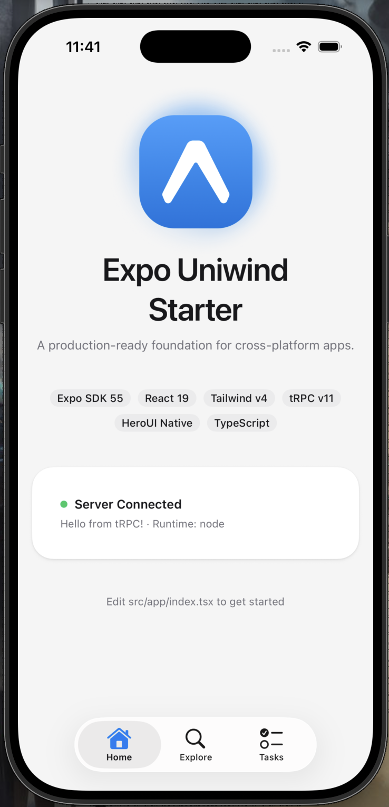
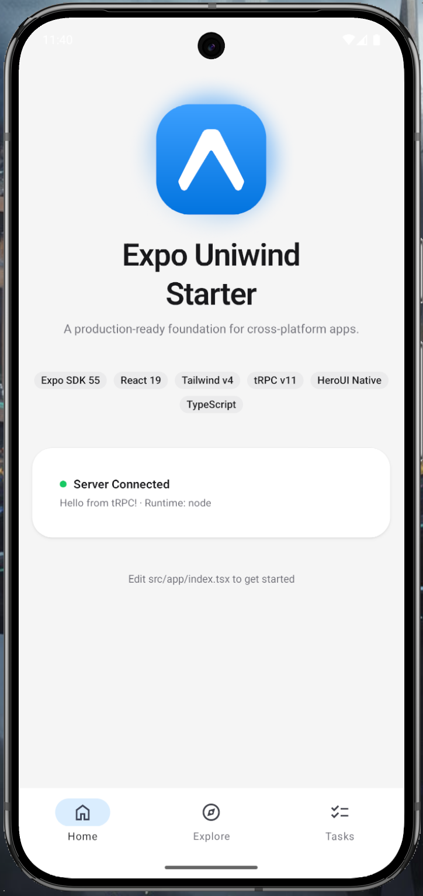

# Expo Uniwind Starter

**Desplega aplicaciones multiplataforma con estilos de Tailwind CSS v4, componentes listos para usar y sin dolor de cabeza con la configuración.**

[](https://expo.dev)
[](https://reactnative.dev/)
[](https://www.typescriptlang.org/)
[](https://pnpm.io/)

<p align="left">
  
  &nbsp;&nbsp;&nbsp;&nbsp;
  
</p>

## Qué incluye

- **Tailwind CSS v4** a través de [Uniwind](https://uniwind.dev/) — estilos basados en utilidades que funcionan en nativo y web
- **[HeroUI Native](https://v3.heroui.com/docs/native/getting-started)** — biblioteca de componentes pulida con botones, campos de entrada, acordeones y más
- **Modo oscuro** — temas completos de claro/oscuro mediante variables CSS, un solo archivo para personalizar
- **Expo Router** — enrutamiento basado en archivos con rutas tipadas y navegación por pestañas nativa
- **[TanStack Form](https://tanstack.com/form)** — formularios compuestos y seguros por tipos mediante `createFormHook` con validación de Zod
- **[Nitro](https://nitro.build/) + [tRPC](https://trpc.io/)** — servidor API seguro por tipos en un monorepo, desplegable en Cloudflare Workers
- **React 19 + React Compiler** — la última versión de React con optimizaciones automáticas
- **TypeScript estricto, Expo ESLint, Oxlint, Oxfmt, Turborepo** — experiencia de desarrollo con opiniones propias, incluyendo ordenación de importaciones y clases de Tailwind
- **Jest + React Native Testing Library + Vitest** — pruebas unitarias de frontend y servidor con proveedores de la app y ayudantes de prueba para tRPC
- **Habilidades de agente** — orientación consciente del contexto para HeroUI Native, corrección de React y patrones de composición reutilizables
- **Instrucciones del arnés Codex** — validación del simulador iOS local a través del plugin Browser Use

## Requisitos previos

- Versión de Node.js fijada en `.node-version`
- pnpm fijado por `packageManager` en `package.json`
- Xcode (para el simulador de iOS) y/o Android Studio (para el emulador de Android)

## Inicio rápido

**1. Clona la plantilla:**

```bash
npx degit AdiRishi/expo-uniwind-starter acme-mobile
cd acme-mobile
pnpm install
```

**2. Renombra el proyecto** — actualiza el `package.json` raíz, el `app.json` móvil y los identificadores del bundle:

```bash
pnpm run rename acme-mobile com.mycompany
```

**3. Inicia el servidor API:**

```bash
pnpm run server:dev   # Nitro dev server on localhost:3000
```

**4. Compila y ejecuta** (en una terminal separada):

```bash
pnpm run prebuild     # Regenerate native projects when needed
pnpm ios              # Compile packages, then run the iOS simulator
pnpm android          # Compile packages, then run the Android emulator
pnpm web              # Compile packages, then start Expo web
```

Los scripts raíz son la interfaz pública para el trabajo diario. Compilan los paquetes internos primero y luego delegan al espacio de trabajo de la app o el servidor.

## Scripts de desarrollo

```bash
pnpm run compile        # Compile shared internal packages
pnpm run lint           # App + server/shared package lint
pnpm run lint:app       # Expo ESLint for the mobile app
pnpm run lint:server    # Oxlint for the API and shared packages
pnpm run typecheck      # TypeScript across all workspaces
pnpm run format         # Oxfmt write
pnpm run format:check   # Oxfmt check
pnpm run check          # Lint + format check + typecheck
```

Los proyectos nativos y los resultados de las tareas se generan e ignoran. Las carpetas `apps/mobile/ios/`, `apps/mobile/android/`, `.expo/`, `.turbo/`, `coverage/` y `dist/` de los paquetes pueden eliminarse y regenerarse desde los scripts.

## Pruebas

Las pruebas unitarias del frontend se ejecutan con Jest y React Native Testing Library. Las pruebas unitarias del servidor se ejecutan con Vitest.

```bash
pnpm run test           # app + server tests
pnpm run test:app       # app tests only
pnpm run test:server    # server tests only
```

Las pruebas de la app están en `apps/mobile/tests/` y reflejan las rutas de `apps/mobile/src/`, con ayudantes compartidos en `apps/mobile/tests/testing-utils/`. Usa constructores pequeños y explícitos por escenario para formas de datos repetidas, y mantén los mocks específicos de función en la prueba o el arnés que los necesite. Las pruebas del servidor están bajo `servers/api/tests/` y reflejan las rutas del backend.

## Pila tecnológica

| Capa       | Tecnología                                     |
| ---------- | ---------------------------------------------- |
| Framework  | Expo 57 + React Native 0.86                    |
| Enrutamiento | Expo Router (basado en archivos, rutas tipadas) |
| Estilos    | Tailwind CSS v4 a través de Uniwind            |
| Componentes| HeroUI Native                                  |
| Animaciones| React Native Reanimated 4                      |
| Servidor   | Nitro 3 (Cloudflare Workers)                   |
| Formularios| TanStack Form + Zod                            |
| API        | tRPC v11 + TanStack Query                      |
| Pruebas    | Jest + React Native Testing Library + Vitest   |
| Herramientas| Turborepo + Expo ESLint + Oxlint + Oxfmt      |
| Lenguaje   | TypeScript 6.0 (estricto)                      |

## Estructura del proyecto

```
apps/
  mobile/
    app.json                  → Expo app config and native plugin settings
    src/
      app/                      → Routes (thin files that render screens)
      screens/                  → Screen components with page logic
      components/
        ui/                     → Design system primitives (buttons, typography, containers)
        form/                   → TanStack Form field and form components
        screens/<screen-name>/  → Components specific to a single screen
      hooks/                    → Custom hooks (theme colors, form context, etc.)
      schemas/                  → Zod validation schemas
      lib/                      → tRPC client, environment config
      global.css                → Theme tokens — edit this to customize your app
    tests/                    → Jest tests mirroring src/
servers/
  api/
    routes/                   → Nitro API routes
    trpc/                     → tRPC router and procedure definitions
    tests/                    → Vitest tests mirroring server paths
packages/
  rpc/                      → Shared tRPC transport configuration
  typescript-config/        → Shared TypeScript defaults for packages
```

## Validación de agente

Este starter incluye un arnés de Codex para validar cambios nativos de extremo a extremo. Los agentes pueden lanzar la app, controlar el simulador iOS a través del plugin Browser Use, verificar el resultado, ejecutar comprobaciones y limpiar.

https://github.com/user-attachments/assets/0b875e4d-f8d2-4b47-bb69-2270725f9c9e

## Recursos

- [Documentación de Expo](https://docs.expo.dev/)
- [Uniwind](https://uniwind.dev/)
- [HeroUI Native](https://v3.heroui.com/docs/native/getting-started)
- [Tailwind CSS v4](https://tailwindcss.com/)
- [Nitro](https://nitro.build/)
- [tRPC](https://trpc.io/)
- [TanStack Query](https://tanstack.com/query)
- [TanStack Form](https://tanstack.com/form)
